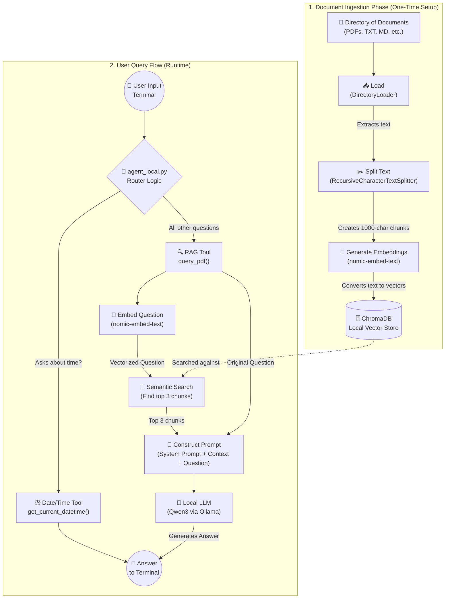

# Local RAG Agent (Qwen3 + Ollama)

This project provides a local Retrieval-Augmented Generation (RAG) pipeline to query entire directories of documents (PDFs, Markdown, TXT, etc.) securely on your own machine. It uses **Ollama** to run models locally, specifically using `nomic-embed-text` for embeddings and `qwen3` for generating answers.

## 🚀 What This Repository Does

This repository serves as a fully functional, privacy-first AI assistant. Instead of sending sensitive documents (like corporate guidelines, research papers, or personal files) to cloud APIs like OpenAI, this project runs entirely on your local hardware.

You can ask the system questions about the provided documents, and it will read through the entire directory, extract the most relevant paragraphs, and use a local Large Language Model (Qwen3) to synthesize a factual answer based *only* on the documents' content. It also includes a basic "Agent" routing system that can dynamically decide whether to answer a question using the RAG pipeline or use a simple programmatic tool (like checking the current time).

## 🧠 What I Learned

Building this project provided hands-on experience with modern AI engineering techniques:

* **Retrieval-Augmented Generation (RAG):** I learned how to overcome the context-window limitations of LLMs by chunking large documents, converting them into mathematical vectors, and using semantic search to retrieve only the relevant information.
* **Vector Databases (ChromaDB):** I gained experience setting up and interacting with ChromaDB to store and query high-dimensional text embeddings efficiently.
* **Local LLM Orchestration:** I learned how to use Ollama to run models like `qwen3` and `nomic-embed-text` locally without relying on paid or external web APIs, ensuring 100% data privacy.
* **LangChain & AI Agents:** I learned how to build a rudimentary AI Agent using LangChain's `@tool` decorators, specifically understanding the difference between standard Python functions and LangChain `StructuredTool` objects (and how to properly `.invoke()` them).
* **Document Processing:** I learned how to extract text from unstructured documents of various types using LangChain's `DirectoryLoader` and split it intelligently using `RecursiveCharacterTextSplitter`.

## Architecture & Data Flow

The system is split into two primary components: `rag_local.py` (the backend pipeline) and `agent_local.py` (the frontend router).

### Data Flow Diagram



## How It Works

### 1. `rag_local.py` (The Heavy Lifter)
This file handles the LangChain RAG pipeline.
* **Loading & Splitting:** Reads the entire directory of documents and breaks them into smaller chunks (1000 characters) to fit within the AI's context window.
* **Embeddings:** Uses `OllamaEmbeddings` to convert the text chunks into mathematical vectors.
* **Vector Store:** Saves those vectors into a local `ChromaDB` database.
* **RAG Chain:** When a question is asked, it searches ChromaDB for the top 3 most relevant paragraphs, builds a strict prompt (`"Answer the question based ONLY on the following context..."`), and passes it to the local Qwen3 model.

### 2. `agent_local.py` (The Router)
This acts as the command-line interface and basic AI Agent router.
* It uses LangChain's `@tool` decorator to define available capabilities (like fetching the current time or querying the PDF).
* **Important Note:** In LangChain, a function wrapped with `@tool` becomes a `StructuredTool` object. It must be called using `.invoke()` rather than as a standard python function.
* The script loops infinitely, taking terminal input, determining if the question is date/time related, and routing it to the appropriate `.invoke()` tool call.

## ⚙️ Setup & Installation

Follow these steps to run the agent locally on your machine.

### 1. Install Prerequisites
* Install [Python 3.8+](https://www.python.org/downloads/).
* Install [Ollama](https://ollama.com/) (required to run the models locally).

### 2. Download the Required AI Models
Open your terminal and pull the required models via Ollama. This might take a few minutes depending on your internet connection:
```bash
# Pull the embedding model used for vector search
ollama pull nomic-embed-text

# Pull the primary LLM used for answering questions
ollama pull qwen3:8b
```
*(Note: If `qwen3:8b` is not available, you can substitute it with `qwen2.5:7b` in `rag_local.py`)*

### 3. Install Python Dependencies
It is highly recommended to use a virtual environment. Inside the project folder, run:
```bash
# Create and activate a virtual environment
python3 -m venv venv
source venv/bin/activate  # On Windows use: venv\Scripts\activate

# Install the required LangChain packages
pip install langchain langchain-community langchain-ollama langchain-chroma python-dotenv unstructured pdf2image pdfminer.six
```

---

## ▶️ Running the Agent

### Step 1: Add Your Documents
Ensure that your documents (PDFs, text files, markdown files, etc.) are located in the same folder as the scripts. The agent will automatically scan the directory and load them all!

### Step 2: Start the Agent
Run the main router script from your terminal:
```bash
python3 agent_local.py
```
* Note: The **very first time** you run this, it will parse your documents and generate vector embeddings. This can take some time depending on the number of files. Subsequent runs will be much faster since it will load the cached database from the `chroma_db/` folder.

### Step 3: Ask Questions!
Once the terminal prompts you, type your question and hit Enter:
```
Ask a question (or press Enter to exit): What is database replication?
```
