# 🤖 Autonomous RAG Code Review Agent

This project provides a fully local, context-aware AI Code Review Agent designed to review Azure DevOps (ADO) Pull Requests. It leverages local Large Language Models (via Ollama) and a local Vector Database (ChromaDB) to autonomously analyze code changes against your business requirements and post inline comments directly on your Pull Request.

## 🚀 What This Repository Does
This repository serves as a fully functional, privacy-first AI reviewer for software engineering teams using Azure DevOps. Instead of sending sensitive proprietary source code to cloud APIs like OpenAI or GitHub Copilot, this project runs entirely on your local hardware.

When a developer opens a Pull Request, you can run this agent in your terminal. It will securely pull the PR diff from ADO, index your entire local repository into a vector database, and use semantic search to extract relevant architectural context. It then passes the PR Diff, the architectural context, and the original User Story ticket to a local Large Language Model (`qwen2.5-coder:14b`). The LLM acts as a Senior Developer, aggressively scrutinizing the logic, and the script automatically posts its feedback as inline threads directly onto the modified lines of code in ADO.

## 🧠 What I Learned
Building this project provided deep hands-on experience with modern AI engineering techniques and Go programming:
1. **Retrieval-Augmented Generation (RAG) on Code**: I learned how to overcome the context-window limitations of LLMs by breaking an entire codebase into semantic chunks, converting them into mathematical vectors, and using semantic search to retrieve only the files relevant to the active PR.
2. **Vector Databases (ChromaDB)**: I gained experience setting up and interacting with ChromaDB's REST APIs in Go, including managing batch limits (sending 100 chunks at a time) to prevent TCP broken pipe errors on massive repositories.
3. **Navigating LLM Limitations**: Small, quantized models (like 14B or 6.7B parameter models) are highly capable but can easily get confused by RAG context or fail at strict formatting. I learned how to engineer robust fallbacks (graceful JSON failure handling) and apply aggressive negative constraints in prompts to tame them.
4. **Complex External APIs**: Posting a simple comment in Azure DevOps requires a surprisingly deep understanding of their nested `threadContext` payloads to accurately pin feedback to a specific line in a diff.
5. **Why Go Instead of Python?**: While Python is the AI standard, building this in Go allowed for blazing fast disk I/O (cloning and chunking thousands of files), robust static typing (safely unmarshaling complex LLM JSON and ADO responses), and frictionless distribution (compiling to a single binary for my team).

## 🤖 Why Qwen2.5-Coder instead of DeepSeek-Coder?
Early iterations of this agent utilized `deepseek-coder:6.7b` because of its speed and efficiency. However, it was ultimately replaced by `qwen2.5-coder:14b` for two critical reasons:
1. **JSON Formatting Failures**: DeepSeek-Coder repeatedly struggled to adhere to the strict JSON array schema required by the Go backend. It would frequently hallucinate dictionary wrappers (`{"results": [...]}`) or return plain text, causing the parser to crash or skip comments.
2. **Reasoning with RAG**: Reviewing a PR requires the LLM to juggle three complex inputs simultaneously: the actual Git Diff, the surrounding RAG architecture context, and the business ticket requirements. The 6.7B DeepSeek model often got "distracted" by the RAG context and attempted to review files that weren't even in the PR. The `qwen2.5-coder:14b` model fits perfectly within a 16GB RAM Mac environment while offering significantly higher reasoning capabilities to strictly adhere to the prompt's guardrails.

## 🏗️ Architecture & Data Flow

The system operates in two distinct phases: Indexing (RAG preparation) and Review (LLM generation).

```mermaid
sequenceDiagram
    participant U as User (CLI)
    participant M as main.go
    participant ADO as Azure DevOps
    participant Git as Local Git
    participant VDB as ChromaDB
    participant AI as Ollama (Local AI)

    U->>M: run `go run . --repo="app" --pr=515 --story="..."`
    M->>ADO: Test ADO Connection & fetch PR Source Branch
    M->>Git: Clone repository & fetch PR branch (`FETCH_HEAD`)
    M->>Git: Generate Diff (`HEAD` vs `FETCH_HEAD`)
    
    rect rgb(20, 40, 60)
        Note over M,VDB: RAG Pipeline (Code Context)
        M->>VDB: Chunk & Embed Entire Cloned Codebase
        M->>VDB: Query Vector DB using the PR Diff
        VDB-->>M: Return Top 3 relevant architecture files
    end

    rect rgb(40, 20, 60)
        Note over M,AI: AI Code Review
        M->>AI: Send Diff + RAG Context + Story Ticket (qwen2.5-coder:14b)
        AI-->>M: Return Strict JSON Array of Code Reviews
    end

    M->>ADO: Parse JSON & Post Inline Comments (Thread Context)
    ADO-->>U: AI feedback visible on exact lines of code in PR!
```



## 🔍 How It Works

### 1. Context Injection (RAG Pipeline)
LLMs cannot fit an entire enterprise codebase into their context window. To solve this, `indexer.go` crawls the repository and splits the code into smaller chunks. We then use Ollama's `nomic-embed-text` to turn those chunks into vectors and store them in ChromaDB. 
When reviewing a PR, `database.go` embeds the PR's `diff` text and searches ChromaDB for the Top 3 most semantically similar code chunks. This gives the AI the "Surrounding Codebase Context" it needs to understand the architecture without exceeding token limits.

### 2. Code Review & Guardrails
`reviewer.go` constructs a massive prompt containing the Diff, the Context, and the Ticket requirements. Because we are using smaller local models, the prompt utilizes intense guardrails (e.g., *"CRITICAL RULE: You must ONLY review files and lines that are present in the Git Diff"*). The LLM is forced via Ollama's `format: json` parameter to output a strict schema (`{"reviews": [...]}`).

### 3. Inline ADO Threading
Once the JSON is verified and parsed by Go, `commenter.go` iterates through the feedback. It dynamically constructs Azure DevOps API payloads utilizing the `threadContext` object (mapping the `filePath` and `rightFileStart.line`) to ensure the comment appears beautifully inline on the "Files" tab, rather than dumped in the generic PR overview.

## 📂 Codebase Summary
* `main.go`: The core orchestrator. Parses command line flags (`--repo`, `--pr`, `--story`, `--task`, `--bug`) and glues the various pipeline stages together in chronological order.
* `azure_devops.go`: Handles the initial connection to Azure DevOps. Retrieves the exact source branch associated with the PR ID and executes the local `git clone` commands.
* `indexer.go`: Traverses the local repository to break the codebase into small, bite-sized textual chunks so they can be embedded into vector math.
* `database.go`: Connects to the local ChromaDB server. Handles batch inserting the chunks (100 at a time to prevent broken pipe errors) and executing semantic searches against the vector space to find files related to the PR diff.
* `reviewer.go`: The AI Brain. Generates the actual Git diff, constructs the prompt, and sends it to the local Ollama API. It safely handles hallucinatory schemas from smaller LLMs.
* `commenter.go`: The feedback publisher. Constructs complex ADO `threadContext` payloads to post comments directly on the affected files and lines within the PR.

## ⚙️ Setup & Installation

### 1. Prerequisites
- **Go 1.21+**: Ensure Go is installed on your machine.
- **Docker**: Required to run the local ChromaDB vector database.
- **Ollama**: Ensure Ollama is installed and running locally.

### 2. Download Required AI Models
You must pull the required models into Ollama before running the agent:
```bash
# Pull the embedding model used for ChromaDB vector search
ollama pull nomic-embed-text

# Pull the primary LLM used for Code Review logic
ollama pull qwen2.5-coder:14b
```

### 3. Spin up ChromaDB
Run ChromaDB locally using Docker on port 8000:
```bash
docker run -d -p 8000:8000 chromadb/chroma
```

### 4. Install Dependencies
Clone this repository and download the Go dependencies:
```bash
go mod tidy
```

### 5. Environment Variables
Create a `.env` file in the root directory with your Azure DevOps credentials:
```env
AZURE_DEVOPS_ORG=YourOrgName
AZURE_DEVOPS_PROJECT=YourProjectName
AZURE_DEVOPS_PAT=YourPersonalAccessToken
```

## ▶️ Running the Agent

Run the agent by specifying the target repository, pull request ID, and the business requirement it should validate against.

```bash
go run . \
  --repo="app" \
  --pr=515 \
  --story="Refactor User-Reference Library to use PageAction Component for all headers."
```
*(Note: You can use `--story`, `--task`, or `--bug` interchangeably based on the type of ADO ticket).*

The agent will clone the code, chunk and embed it, review the diff, and post the feedback directly to ADO!
